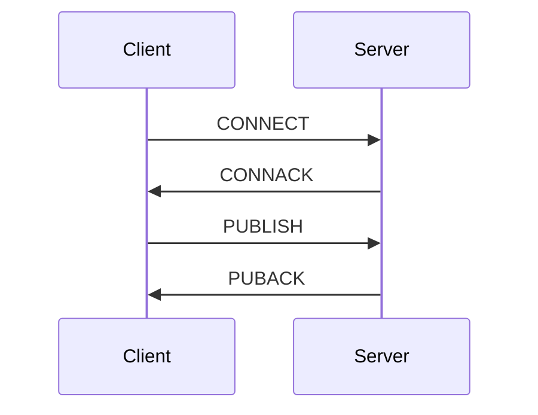

# Writing Excellent Protocol PRs

## Overview

Writing pull requests for protocol specifications requires precision, clarity, and comprehensive documentation. This guide covers how to create PRs that facilitate effective review and implementation of standardized protocols.

## PR Structure

### Title Format
```
<protocol-name>: <brief-description>
```

Examples:
- `HTTP/3: Add QUIC connection migration support`
- `WebSocket: Clarify frame masking requirements`
- `OAuth 2.0: Define PKCE for public clients`

### PR Description Template

```markdown
## Summary
Brief overview (2-3 sentences) of the protocol change.

## Motivation
Explain why this change is necessary. Include:
- Problem statement
- Use cases
- Security implications

## Specification Changes
- [ ] Added new section X.Y
- [ ] Modified requirement in section A.B
- [ ] Deprecated feature Z

## Compatibility
- [ ] Backward compatible
- [ ] Breaking change (justify below)
- [ ] Optional extension

## Implementation Impact
- Reference implementations affected
- Testing requirements
- Performance considerations

## Verification
- [ ] Examples provided
- [ ] Test vectors included
- [ ] Security review completed
```

## Key Sections to Include

### 1. Protocol Diagrams
Include ASCII or Mermaid diagrams for:
- Protocol flow
- Message format
- State machines



### 2. Formal Specification
Use precise language with RFC keywords:
- **MUST** - Absolute requirement
- **SHOULD** - Recommended but not required
- **MAY** - Optional feature

### 3. Test Vectors
Provide concrete examples with expected inputs/outputs:
```json
{
  "input": "0x01020304",
  "expected": "0x10203050",
  "description": "Test vector for checksum algorithm"
}
```

## Review Checklist

Before submitting:
- [ ] All sections completed
- [ ] Examples validated
- [ ] Security implications assessed
- [ ] Backward compatibility addressed
- [ ] Related issues referenced
- [ ] Implementation guidance provided

## Common Pitfalls

- **Vague requirements** - Always specify exact byte layouts
- **Missing edge cases** - Document timeout, error, and recovery behaviors
- **Inconsistent terminology** - Maintain consistent naming throughout
- **Insufficient examples** - Provide at least one complete example per new feature